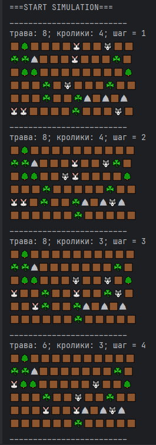
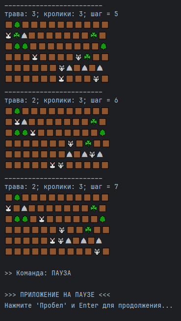
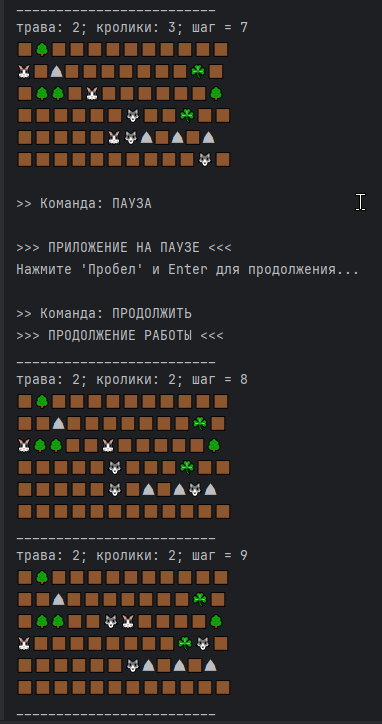

# Симуляция 

Программа написана в рамках проекта roadmap Сергея Жукова

Настройка параметров симуляции производится путем изменения соответствующих значений в файле application.properties .

При запуске программы на карте случайным образом генерируются Деревья, Скалы, Трава, Кролики и Волки.

На каждом шаге симуляции Кролики пытаются добраться до травы, чтобы ее съесть, а Волки пытаются догнать Кроликов, чтобы съесть их. Когда Трава на карте заканчивается, Кролики больше не двигаются. 

Когда съеден последний Кролик, симуляция завершается.

Запущенную программу можно приостановить, рассмотреть карту симуляции, а затем запустить далее.

Поставить/Снять с паузы программу можно, нажав Пробел (Space) и Пуск (Enter).

